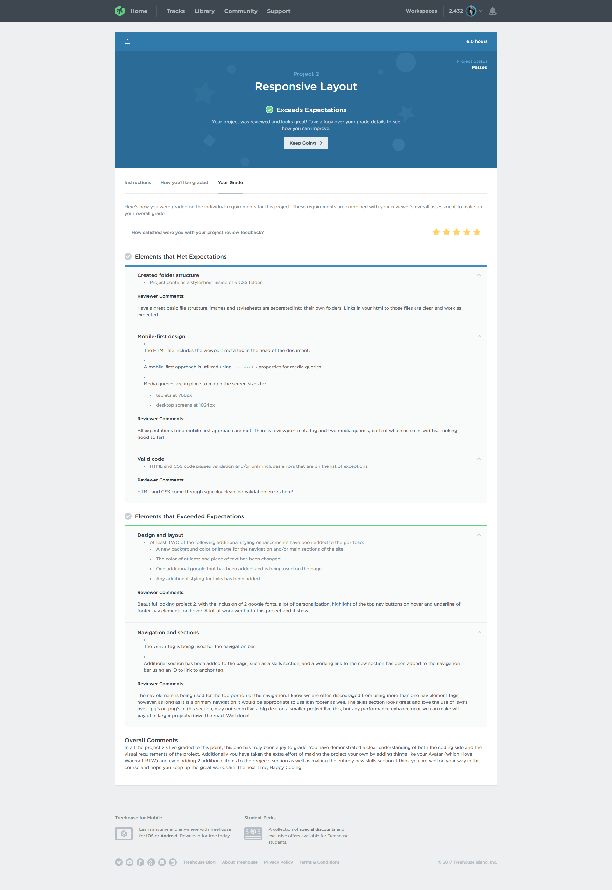
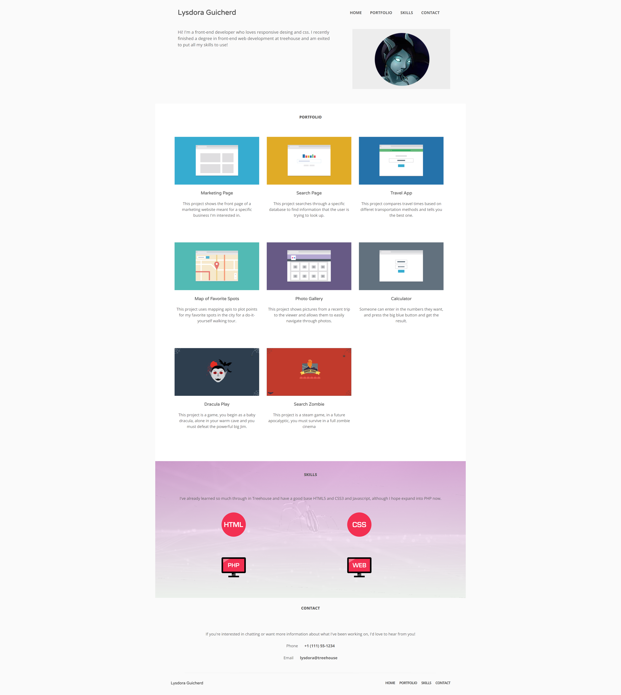

# Responsive Layout
## techdegree-project-2

**Project Submit 14/09/2017**

**Passed with exceeds expectations**

-----------------------------------------------------

In this project you'll build a responsive, mobile-first layout using HTML and CSS. The layout should demonstrate an understanding of responsive design by adjusting to accommodate small, medium, and large screen sizes.

You will write CSS to style the page for a small mobile device first. Then, using media queries, you’ll add breakpoints to adjust the layout for wider tablet and desktop screens.

**Project instruction**

* Create an index.html and styles.css file.
* Create a folder called css and put your styles.css file inside of it. The name of the folder should not be capitalized.
* Link the styles.css file to index.html

-----------------------------------------------------

**Build the layout using a mobile first design:**

* Make sure the HTML file includes the viewport meta tag in the head of the document. See Configuring the Viewport to understand why and how to add this tag.
* Look at the provided mockup for the mobile device and add the same header, titles, content and footer information into your index.html file.
* Use the provided images for the portfolio gallery images shown in the mockups.
* Use a font from Google Fonts for the text.
* Use CSS to style your layout to match the provided mobile mockup. Make sure your mobile design matches the mockup at 320px screen size.

----------------------------------------------------

**Once you have everything in place for the mobile layout, use media queries to add breakpoints to adjust the layout for wider tablet and desktop screens.**

* Match the design as it should look on a tablet device that is 768px wide and a desktop screen size that is 1024px wide.
* Use a mobile-first approach by writing your media queries using the min-width property in your CSS.

----------------------------------------------------

**Once all your breakpoints are in place, double check your layout matches the three mockups.**
* The design does not need to be exact, but the general spacing and arrangement of the elements should match the design of the mockups for mobile, tablet and desktop.
* Feel free to replace the profile image and customize the text, but the layouts should match the mockups.

----------------------------------------------------

**Link your navigation menu to the correct sections of the page using IDs to link to anchor tags. See this video on Linking to Sections of a Web Page.**

----------------------------------------------------

**Make sure to check your code is valid by running it through an HTML and CSS validator.**
* Links to the validators can be found in the Project Resources. This will help you spot any errors that might be in your code.
  *  **There are a few exceptions that you don’t need to fix:**
  * Don’t worry about any warnings, we just need you to check any errors that might be there.
  * If CSS validator flags use of calc, vendor prefixes or pseudo-elements/pseudo-classes these errors should be ignored.
  * If HTML validator flags use of pipe (‘|’) in Google font links/URLs this error can also be ignored.
  
  ----------------------------------------------------
 
**Before you submit your project for review, make sure you can check off all of the items on the Student Project Submission Checklist. The checklist is designed to help you make sure you’ve met the grading requirements and that your project is complete and ready to be submitted!**

----------------------------------------------------

**Extra Credit**

Add an additional section to the page, such as a skills section. Don’t forget to create a working link to your new section in the navigation menu.

**Add at least TWO additional items to to further style and enhance the portfolio:**
 * A new background color for the navigation and/or main sections of the site.
 * Change the color of at least one piece of text.
 * Add one additional google font that is being used on the page.
 * Any additional styling for links (ie, borders, hover states).
 
 ## My Submission ##
 

### desktopk ###

### Tablet ###

### Mobile ###

